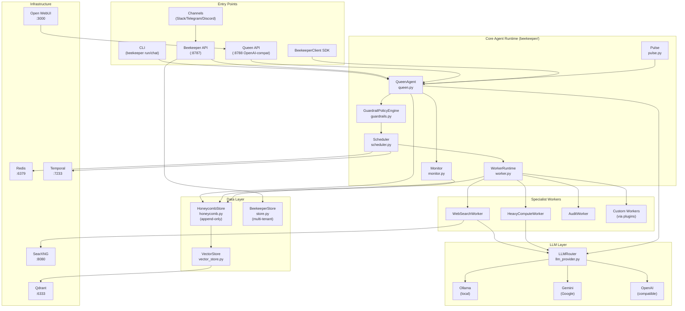
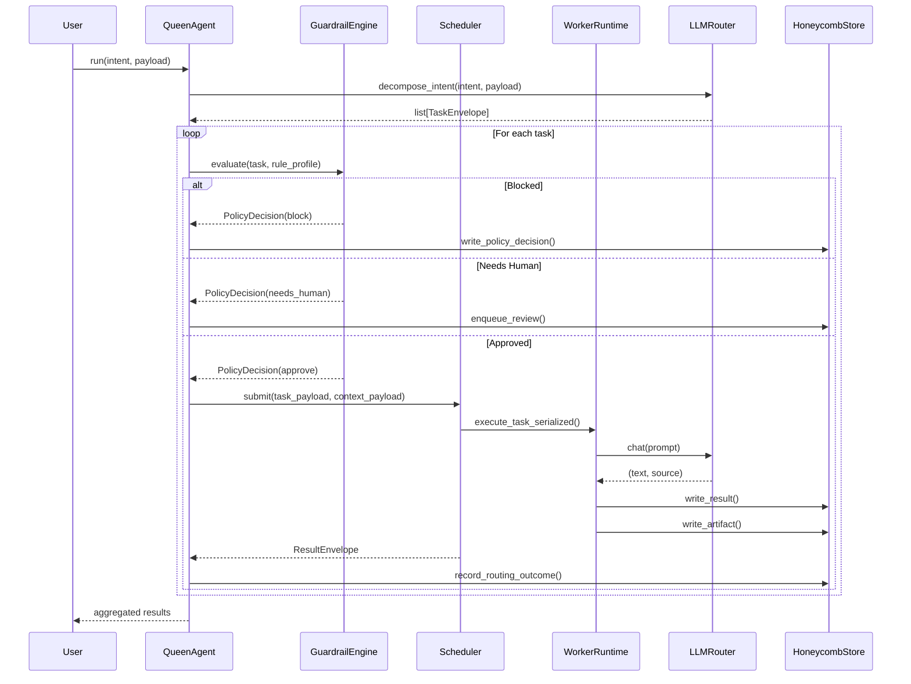
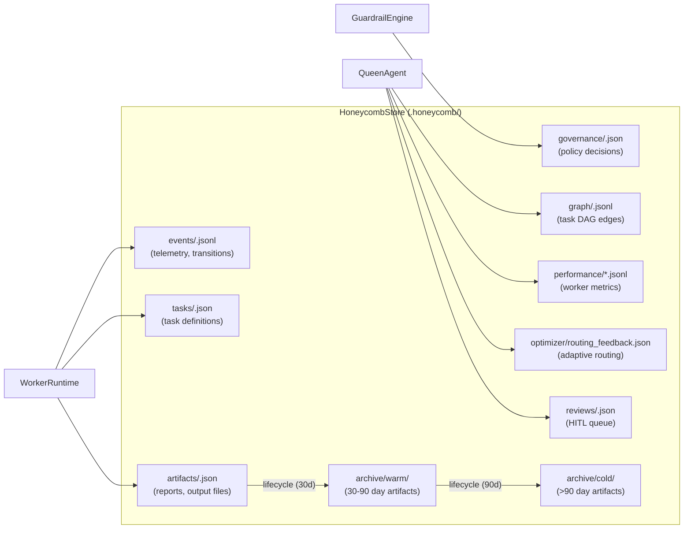
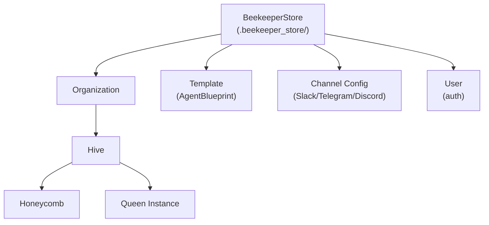
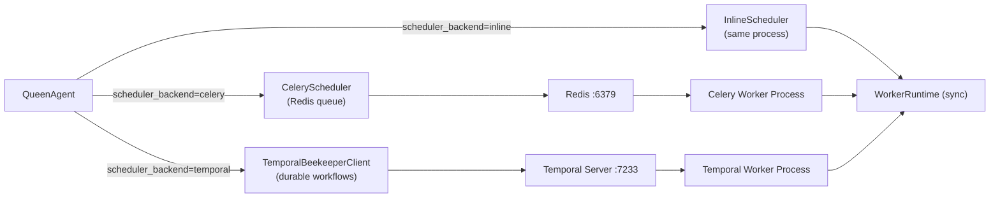
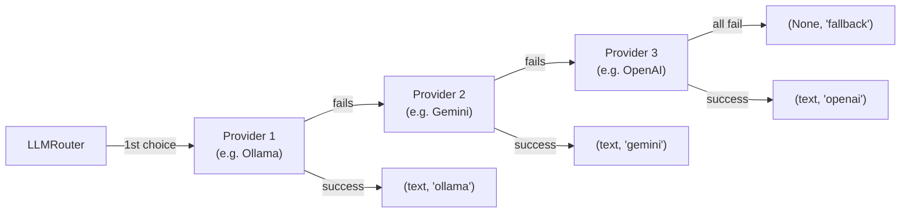

# 02 — System Diagrams

## Component Map

---

## Request Lifecycle (Sequence)

---

## Data Flow: Honeycomb Storage

---

## Multi-Tenant Hierarchy

---

## Scheduler Backend Selection

---

## LLM Provider Fallback Chain

